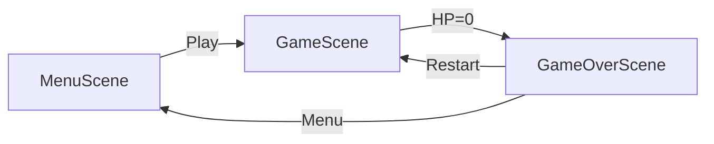

# Etap 3: Game Loop & Waves

## Przegląd

Dodajemy trzy nowe sceny (Menu, GameOver, UI) oraz system fal zastepujacy obecny ciagly spawning. Obecny `GameScene` zostanie rozszerzony o UI i logike fal.

## Architektura scen




## Zadania implementacyjne

### 1. MenuScene - Start Screen

Nowy plik: [`src/scenes/MenuScene.js`](src/scenes/MenuScene.js)

- Tytul gry "ROBO ARENA"
- Przycisk "PLAY" startujacy `GameScene`
- Proste instrukcje sterowania (WASD + mysz)
- Estetyka retro-arcade (zielony tekst na ciemnym tle)

### 2. GameOverScene - Ekran konca gry

Nowy plik: [`src/scenes/GameOverScene.js`](src/scenes/GameOverScene.js)

- Wyswietlenie "GAME OVER" + finalny wynik
- Przycisk "RESTART" -> `GameScene`
- Przycisk "MENU" -> `MenuScene`
- Przekazanie score przez `this.scene.start('GameOverScene', { score })`

### 3. UI w GameScene

Modyfikacja: [`src/scenes/GameScene.js`](src/scenes/GameScene.js)

- **Score UI** - tekst w gornym lewym rogu (aktualizowany przy zabiciu wroga)
- **HP UI** - serca/prostokaty w gornym prawym rogu (3 serca = 3 HP)
- **Wave UI** - numer fali (np. "WAVE 1") na srodku gory
- Wywolanie `GameOverScene` gdy `player.hp <= 0`

### 4. Wave System

Modyfikacja: [`src/scenes/GameScene.js`](src/scenes/GameScene.js)Zamiana obecnego ciaglego spawningu na system fal:

```javascript
// Struktura wave:
this.currentWave = 1;
this.enemiesInWave = 5; // +2 na kazda fale
this.enemiesSpawned = 0;
this.enemiesKilled = 0;
this.waveActive = false;
this.betweenWaves = true; // 3-5 sek przerwy
```

Logika:

- Fala startuje po 3 sekundach przerwy
- Spawn wrogów co 1-2 sekundy az do limitu fali
- Gdy wszyscy wrogowie zabici -> przerwa -> nastepna fala
- Kazda fala: +2 wrogów, opcjonalnie szybszy spawn

### 5. Aktualizacja main.js

Modyfikacja: [`src/main.js`](src/main.js)

- Dodanie MenuScene i GameOverScene do tablicy scen
- MenuScene jako pierwsza scena (startowa)

## Kolejnosc implementacji

1. **MenuScene** - szybki efekt wizualny, od razu widac postep
2. **GameOverScene** - zamyka game loop
3. **UI w GameScene** - score, HP, wave number
4. **Wave System** - zamiana spawningu na fale
5. **Integracja** - polaczenie scen, przekazywanie danych

## Kluczowe fragmenty kodu

Obecny spawn timer do zamiany:

```56:62:src/scenes/GameScene.js
        this.spawnTimer = this.time.addEvent({
            delay: Phaser.Math.Between(2000, 3000),
            callback: this.spawnEnemy,
            callbackScope: this,
            loop: true
        });
```

Obecny TODO w Player.js do uzupelnienia:

```99:102:src/entities/Player.js
        if (this.hp <= 0) {
            this.hp = 0;
            // TODO: Game Over (w następnym kroku)
        }
```